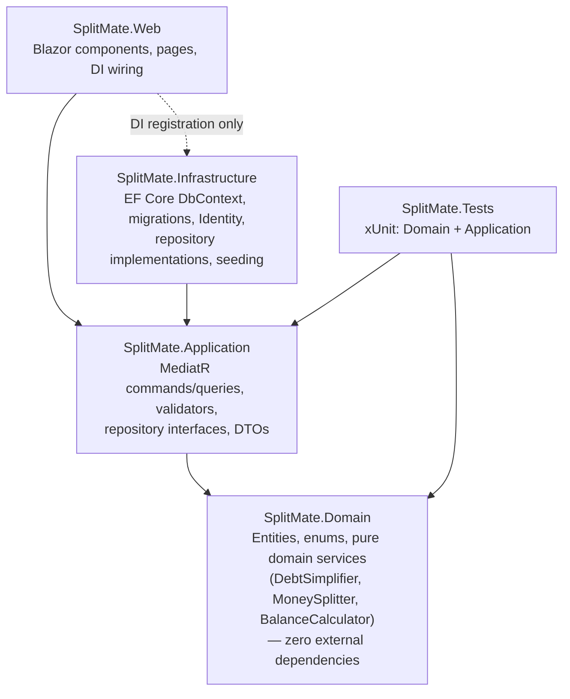

# SplitMate

A Splitwise-style expense-splitting web app: create groups, add expenses with
flexible splits, see who owes whom, and settle up with the minimum fuss.
Single currency: **INR (₹)** — all money is `decimal`, never floating point.

## Tech stack

- **.NET 10** (LTS), **Blazor Web App** with **Interactive Server** render mode
- **Clean Architecture** with **CQRS** via **MediatR**
- **EF Core 10** + **SQL Server LocalDB**, **ASP.NET Core Identity** (cookie auth)
- **FluentValidation** for command validation
- **xUnit + FluentAssertions** (44 tests)

## Architecture



Dependency rule: **Domain ← Application ← Infrastructure / Web**. The Web project
references Infrastructure solely to call `AddInfrastructure()` at startup; pages talk
to the Application layer through MediatR's `ISender`.

| Project | Contents |
|---|---|
| `src/SplitMate.Domain` | `Group`, `GroupMember`, `Expense`, `ExpenseShare`, `Settlement`, `SplitType`, pure services |
| `src/SplitMate.Application` | One folder per feature (`Groups`, `Expenses`, `Settlements`, `Balances`, `Dashboard`) with commands, queries, handlers, validators, DTOs; `Result`/`Result<T>`; repository + user-directory interfaces; MediatR validation pipeline behavior |
| `src/SplitMate.Infrastructure` | `SplitMateDbContext` (IdentityDbContext), migrations, `AppUser`, repositories, `UserDirectory`, `DbSeeder` |
| `src/SplitMate.Web` | Blazor pages (Dashboard, Groups, Expenses, Balances, Settle up) + Identity account UI |
| `tests/SplitMate.Tests` | DebtSimplifier, MoneySplitter rounding, balance invariants, command validators |

## Why Interactive Server render mode

- **Single process, no API layer**: components call MediatR handlers directly over the
  SignalR circuit — no HTTP endpoints, serialization contracts, or client-side state
  duplication to maintain.
- **Trusted execution**: validation and authorization run on the server; nothing
  sensitive ships to the browser (no WASM download, fast first paint).
- **Right fit for the workload**: a CRUD-ish, low-latency-tolerant app with modest
  concurrent users is exactly the Interactive Server sweet spot. The Identity account
  pages remain statically rendered (as scaffolded), which they require.

The one Blazor-Server-specific wrinkle — DI scopes living as long as the circuit — is
handled by giving repositories an `IDbContextFactory<SplitMateDbContext>` and creating
a short-lived `DbContext` per call, avoiding concurrent-use and stale-data issues.

## Debt simplification

`DebtSimplifier` (in `SplitMate.Domain.Services`) is a **static, pure, side-effect-free**
service. Input: `(UserId, NetBalance)` per user (must sum to exactly zero — it throws
otherwise). Output: a list of `SimplifiedDebt(FromUserId, ToUserId, Amount)`.

Algorithm — **greedy max-debtor → max-creditor matching**:

1. Partition users into debtors (negative net) and creditors (positive net); drop zeros.
2. Pick the largest debtor and the largest creditor; transfer
   `min(|debt|, credit)`; record the payment; update both balances.
3. Whoever hits zero leaves the pool. Repeat until everyone is at zero.

Each round zeroes out at least one participant, and the final round zeroes two, so the
result is **at most n − 1 transactions** for n users with non-zero balances. Finding the
*true minimum* number of transactions is **NP-hard** (it reduces to partitioning balances
into zero-sum subsets), so the greedy approximation is the standard practical choice —
the same approach Splitwise popularized. Ties on amount are broken by `UserId`
(ordinal), so the output is fully deterministic and reproducible.

### Balance formula

```
net = (total they paid for expenses) − (total of their owed shares)
    + (settlements they paid)        − (settlements they received)
```

Positive net ⇒ others owe them; negative ⇒ they owe others. Group balances always sum
to zero (asserted in tests). Note the settlement signs: paying a settlement *reduces
your debt* (raises your net) and receiving one reduces what you're owed. The spec's
formula listed these two terms with swapped signs, which would make recording a
settlement *increase* the debt — the implementation uses the semantically correct
direction, and the tests assert that a settlement zeroes the matching debt.

### Rounding (largest-remainder method)

When a split produces fractional paise (e.g. ₹100 ÷ 3), `MoneySplitter`:

1. Rounds each raw share **down** to 2 decimals.
2. Hands out the leftover paise one at a time — **largest fractional remainder first,
   ties broken by `UserId`** — until the shares sum to the total exactly.

The share sum always equals the expense amount exactly, and no share is ever negative.
Covered by tests for ₹100 ÷ 3, ₹0.01 ÷ 2 and ₹99.99 ÷ 7 (note ₹0.01 ÷ 2 legitimately
produces a ₹0.00 share for one participant).

## Setup

Prerequisites: [.NET 10 SDK](https://dotnet.microsoft.com/download/dotnet/10.0),
SQL Server **LocalDB** (installed with Visual Studio or SQL Server Express), and
optionally the EF CLI (`dotnet tool install -g dotnet-ef`).

```powershell
# 1. restore + build (zero warnings)
dotnet build

# 2. run the tests
dotnet test

# 3. create/update the database
dotnet ef database update --project src/SplitMate.Infrastructure --startup-project src/SplitMate.Web

# 4. run the app  →  http://localhost:5188
dotnet run --project src/SplitMate.Web --launch-profile http
```

The connection string lives in `src/SplitMate.Web/appsettings.Development.json`
(database `SplitMateDb` on `(localdb)\mssqllocaldb`). In Development the app also
applies pending migrations itself and seeds demo data on first run, so step 3 is
optional if you just want to try it.

### Demo credentials

Seeded automatically on first run (1 group **“Goa Trip”** with 4 expenses across all
three split types):

| Email | Password | Name |
|---|---|---|
| `aarav@demo.com` | `Demo@Pass1` | Aarav Sharma |
| `diya@demo.com` | `Demo@Pass1` | Diya Patel |
| `rohan@demo.com` | `Demo@Pass1` | Rohan Mehta |

## Screenshots

> _Placeholder — add screenshots here._
>
> - Dashboard (totals + recent activity)
> - Group detail (members, expenses)
> - Balances (net balances + suggested settlements)
> - Add expense (split editor)

## Decisions where the spec was silent (or contradictory)

- **`AppUser` lives in Infrastructure, not Domain.** The spec lists
  `AppUser : IdentityUser` in the domain model but also demands a dependency-free
  Domain. The zero-dependency rule wins: domain entities reference users by their
  string `Id` only, and the Application layer resolves display names through an
  `IUserDirectory` abstraction implemented over Identity.
- **Settlement signs** in the balance formula are implemented semantically (see above).
- **`Settlement.CreatedAtUtc`** was added beyond the spec's field list so the dashboard
  activity feed can interleave expenses and settlements precisely (`Date` is only
  day-granular).
- **“Own expenses” = expenses you paid for.** The spec's `Expense` has no separate
  creator field, so edit/delete rights belong to the payer.
- **Share values must be > 0** for Exact-amounts and Percentage splits (a participant
  with a zero share isn't a participant). Zero shares *arising from rounding* on Equal
  splits (₹0.01 ÷ 2) are allowed, per the rounding rule.
- **Dashboard totals don't net across groups**: “total I owe” is the sum of my negative
  per-group nets, “total I am owed” the sum of positive ones.
- **Editing a Percentage expense** re-derives percentages from the stored share amounts
  (percentages themselves aren't persisted); for unusual splits they may need a ±0.01
  nudge to sum back to 100.
- **Email confirmation is disabled** (`RequireConfirmedAccount = false`) because the
  scaffold ships a no-op email sender; registration signs you in immediately.
- **Validation strategy**: FluentValidation runs in a MediatR pipeline behavior and
  returns failed `Result`s (no exceptions for control flow); forms surface those errors
  inline alongside DataAnnotations for instant field-level feedback.
- **Queries also return `Result<T>`** for uniformity with commands; handlers never
  return entities.
- **Dashboard CQRS folder**: the spec names four feature folders; the dashboard query
  is cross-cutting, so it gets its own `Application/Dashboard` folder.

## Test suite (44 tests)

- `DebtSimplifier`: empty input, all-zero balances, 1↔1, 1↔many, many↔1, 5+-user case
  (asserting ≤ n−1 transactions and that applying the output zeroes every balance),
  non-zero-sum throws, deterministic `UserId` tie-breaking, no zero/negative outputs.
- `MoneySplitter`: ₹100 ÷ 3, ₹0.01 ÷ 2, ₹99.99 ÷ 7, exact-sum + no-negative-share
  invariants across assorted totals, percentage splits (terminating and
  largest-remainder distribution), invalid-percentage and empty-participant rejection.
- `BalanceCalculator`: zero-sum invariant with mixed expenses + settlements, settlement
  fully/partially clearing a debt, idle members staying at zero.
- Validators: `CreateExpenseCommandValidator` (amount, description, exact-sum,
  percentage-sum, membership of payer/participants, duplicates),
  `CreateSettlementCommandValidator` (amount, 2-decimal rule, self-payment,
  membership), `CreateGroupCommandValidator` (name rules).
